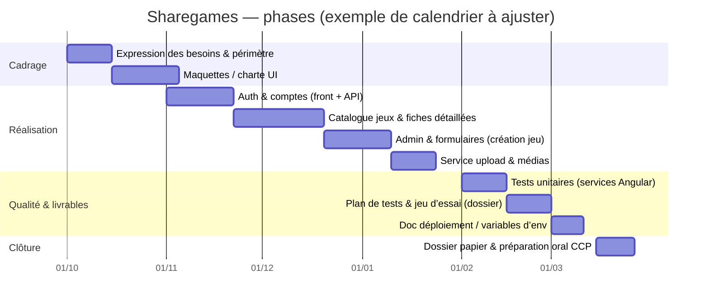
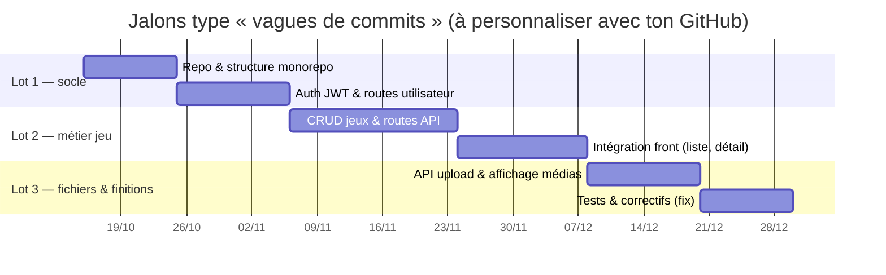
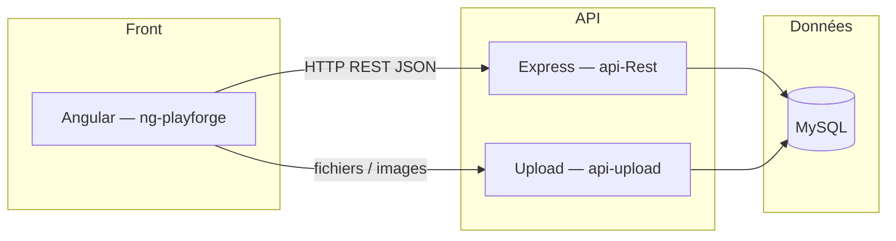

# Planning — Gantt & lien avec Git (Sharegames)

Ce fichier sert de **support visuel** pour la diapo *« Gestion de projet »* (point 14 de `FICHE-DIAPO-ORAL-CCP-SHAREGAMES.md`).

**Limite actuelle :** le workspace local n’est **pas** un dépôt Git (`git` absent), donc les diagrammes ci‑dessous sont des **modèles cohérents** avec ton stack (Angular, API Express, service upload, MySQL). Tu remplaces les dates par celles de **ton** historique GitHub (voir § 3).

---

## 1. Diagramme de Gantt — phases projet (périmètre CCP)

Basé sur les blocs habituels : besoins → conception → front → API → médias → tests → préparation oral / dossier.



---

## 2. Diagramme de Gantt « rythme de livraison » (lié aux commits)

Même sans tes vrais pushs, on peut montrer au jury **comment** le planning suit des **jalons** (features livrées par vague). Exemple de découpage par **sprints / lots** — à recaler sur tes dates Git réelles.



Pour l’oral : une capture **GitHub → Insights → Contributors** ou **Network**, + ce Gantt, montre la **cohérence** entre planning et historique.

---

## 3. Récupérer *tes* dates depuis GitHub (à exécuter sur ta machine)

Dans le clone de **ton** dépôt (celui qui est sur GitHub) :

```bash
# Liste des commits avec date (pour recaler le Gantt ou un tableau Excel)
git log --reverse --format="%ad | %s" --date=short

# Fréquence par semaine (aperçu charge de travail)
git log --format="%ad" --date=short | cut -c1-7 | sort | uniq -c
```

Tu copies les **premières / dernières dates** de grosses features dans le `gantt` (sections et `start` / `duration`), ou tu exportes vers Excel / Project / Notion Gantt.

---

## 4. « UML » utile pour la même diapo (pas un Gantt)

Le **Gantt n’est pas un diagramme UML**. En revanche, pour compléter le dossier, un **diagramme de packages** ou **déploiement** est souvent attendu. Exemple minimal **packages** (front / API / BDD) :



Si ton RE exige du **UML strict** (cas d’utilisation, séquences), réutilise plutôt les diagrammes déjà prévus dans le dossier (CU, séquences auth, etc.).

---

*Fichier généré comme base de travail — à ajuster avec ton planning réel et ton export GitHub.*
