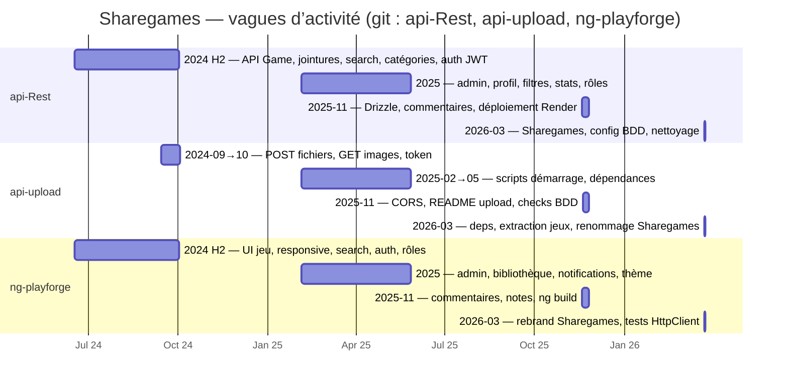
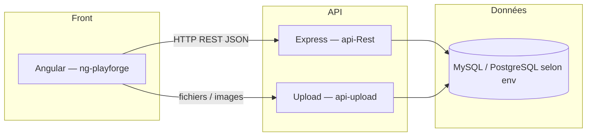

# Planning — Gantt calé sur Git (Sharegames)

Support pour la diapo *« Gestion de projet »* (`FICHE-DIAPO-ORAL-CCP-SHAREGAMES.md`, point 14).

Les données ci‑dessous proviennent des dépôts **`api-Rest`**, **`api-upload`** et **`ng-playforge`** (commandes exécutées le 2026-03-25).

---

## 1. Fréquence des commits par mois (aperçu charge)

| Mois (YYYY-MM) | api-Rest | api-upload | ng-playforge |
|----------------|----------|------------|--------------|
| 2024-06 | 44 | — | 1 |
| 2024-07 | 106 | — | 10 |
| 2024-08 | 3 | — | 6 |
| 2024-09 | 18 | 7 | 9 |
| 2024-10 | 3 | 2 | 3 |
| 2025-02 | 1 | 1 | 2 |
| 2025-04 | 4 | 1 | 8 |
| 2025-05 | 1 | 1 | 7 |
| 2025-11 | 13 | 4 | 8 |
| 2026-03 | 2 | 3 | 5 |
| *Autres mois* | *0* | *0* | *0* |

**Lecture rapide :** pic d’activité sur **api-Rest en juillet 2024** (docs / README / diagrammes + démarrage API) ; **vague 2025-11** (migration Drizzle, commentaires, déploiement, refactors Angular) ; **2026-03** (Sharegames, tests, finitions).

---

## 2. Diagramme de Gantt — vagues dérivées des trois dépôts

Chaque barre = **période réelle** entre le **premier** et le **dernier** commit de la vague (durée en jours). Les intitulés résument les thèmes vus dans les messages de commit.



*Remarque :* `api-upload` démarre en **2024-09-14** (pas de commits en juin–août dans ce dépôt) : la barre `up_a` est plus courte que `rest_a` / `ng_a`, ce qui se voit sur le diagramme.

---

## 3. Commandes Git (réutilisables)

### Liste des commits avec date (ordre chronologique)

```bash
git log --reverse --format="%ad | %s" --date=short
```

À lancer dans chaque dossier : `api-Rest`, `api-upload`, `ng-playforge`.

### Fréquence par mois (équivalent `cut | uniq -c`)

**PowerShell (Windows) :**

```powershell
git log --format="%ad" --date=format:%Y-%m | Sort-Object | Group-Object | Sort-Object Name | ForEach-Object { "$($_.Count) $($_.Name)" }
```

**Git Bash / Linux / macOS :**

```bash
git log --format="%ad" --date=short | cut -c1-7 | sort | uniq -c
```

---

## 4. Architecture (rappel — pas du Gantt)



---

*Généré à partir de l’historique Git local des trois dossiers — à recopier ou exporter en image depuis un viewer Mermaid (VS Code, mermaid.live) pour la diapo.*
