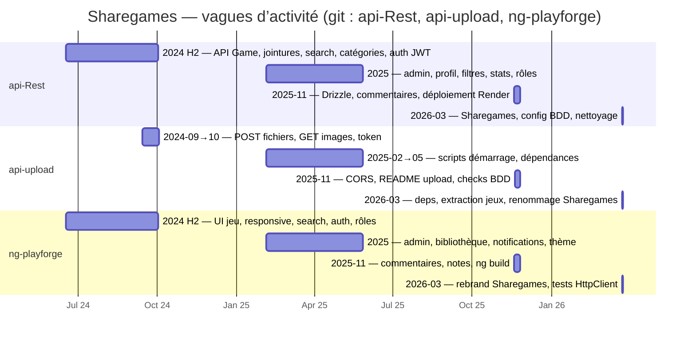

# Planning — Gantt calé sur Git (Sharegames)

Support pour la diapo *« Gestion de projet »* (`FICHE-DIAPO-ORAL-CCP-SHAREGAMES.md`, point 14).

---

## 1. Fréquence des commits par mois (aperçu charge)

| Mois (YYYY-MM) | api-Rest | api-upload | ng-playforge |
|----------------|----------|------------|--------------|
| 2024-06 | 44 | — | 1 |
| 2024-07 | 106 | — | 10 |
| 2024-08 | 3 | — | 6 |
| 2024-09 | 18 | 7 | 9 |
| 2024-10 | 3 | 2 | 3 |
| 2025-02 | 1 | 1 | 2 |
| 2025-04 | 4 | 1 | 8 |
| 2025-05 | 1 | 1 | 7 |
| 2025-11 | 13 | 4 | 8 |
| 2026-03 | 2 | 3 | 5 |
| *Autres mois* | *0* | *0* | *0* |

---

## 2. Diagramme de Gantt — vagues dérivées des trois dépôts

---

